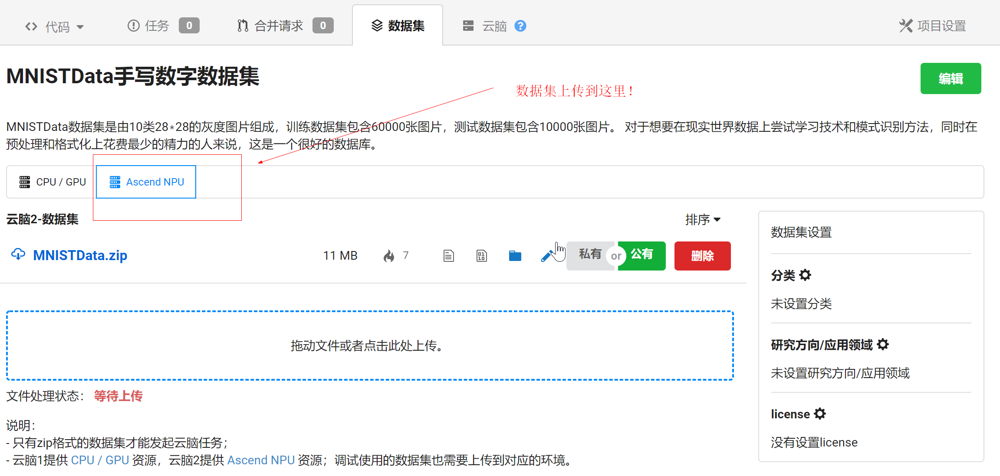
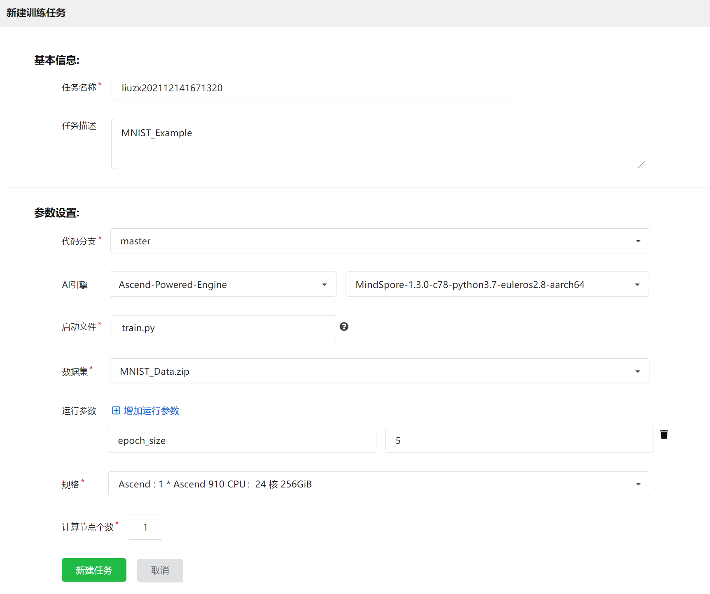
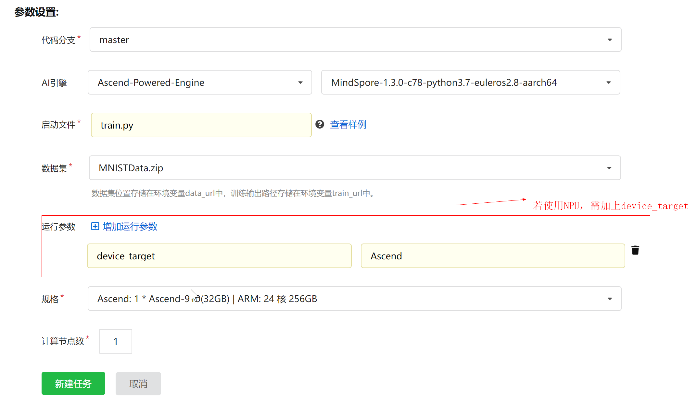
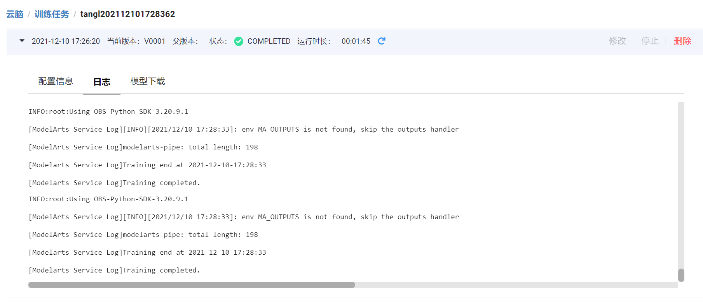
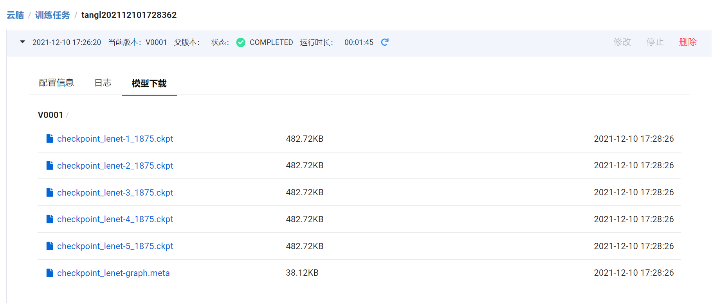

# 如何在启智平台上进行模型训练 - NPU版本

请注意！智算网络NPU训练任务已经改版，请参考最新的样例代码进行修改，用户需要在代码里使用mox拷贝数据集并解压！

- **启智集群和智算网络集群的单数据集训练，多数据集训练，训练使用方式不同，请按需求选择一种训练方式即可，注意区别(以下环境默认是训练环境)**：
  - 启智集群单数据集单卡或多卡的训练示例请参考示例中[train.py](https://git.openi.org.cn/OpenIOSSG/MNIST_Example/src/branch/master/train.py)的代码注释
  - 启智集群单数据集单卡或多卡**加载模型**的训练示例请参考示例中 [pretrain.py](https://git.openi.org.cn/OpenIOSSG/MNIST_Example/src/branch/master/pretrain.py)的代码注释
  - 启智集群单数据集单卡的推理示例请参考示例中[inference.py](https://git.openi.org.cn/OpenIOSSG/MNIST_Example/src/branch/master/inference.py)的代码注释
  - 启智集群多数据集单卡或多卡的训练示例请参考示例中[train_for_multidataset.py](https://git.openi.org.cn/OpenIOSSG/MNIST_Example/src/branch/master/train_for_multidataset.py)的代码注释
  - 启智集群训练任务已经将ImageNet-1k数据集挂载到训练镜像，具体使用方法请参考示例中[read_imagenet.py](https://git.openi.org.cn/OpenIOSSG/MNIST_Example/src/branch/master/read_imagenet.py)的代码注释
  - 智算网络集群单数据集或多数据集，单卡或多卡训练示例请参考示例中[train_for_c2net.py](https://git.openi.org.cn/OpenIOSSG/MNIST_Example/src/branch/master/train_for_c2net.py)的代码注释
  - 智算网络集群单数据集或多数据集，单卡或多卡**加载模型**的训练示例请参考示例中[pretrain_for_c2net.py](https://git.openi.org.cn/OpenIOSSG/MNIST_Example/src/branch/master/pretrain_for_c2net.py)的代码注释
  - 更多关于分布式训练的教程可参考mindspore官网教程[mindspore分布式训练教程](https://www.mindspore.cn/tutorial/training/zh-CN/r1.2/advanced_use/distributed_training_ascend.html)
- **NPU启智集群中单数据集和多数据集的区别**：
  - 超参数不同：
    单数据集的超参数通过--data_url传递
    多数据集的超参数通过--multi_data_url传递，并且需要保留--data_url
  - 数据集使用方式不同：
    如本示例中单数据集MNISTData.zip的使用方式是:数据集位于/cache/data下
    多数据集时MNISTData.zip的使用方式是：数据集位于/cache/data/MNISTData/下
- **NPU启智集群和智算网络集群的区别**：
  - 启智集群需要使用moxing拷贝数据到obs
  - 智算网络集群需要moxing拷贝数据到obs,并且需要手动解压数据集
- **NPU启智集群调试镜像和训练镜像的环境的区别**：
  - 若想要使用调试环境的多卡并行训练，可参考示例[调试环境多卡并行示例](https://git.openi.org.cn/OpenIOSSG/MNIST_Example_NPU_Debug)

## 1 概述

- 本项目以LeNet-MNIST为例，简要介绍如何在启智AI协同平台上使用MindSpore完成训练任务，并提供单数据集的训练，多数据集的训练，智算网络的训练，单数据集推理等训练代码示例，旨在为AI开发者提供启智npu训练示例。对于示例代码有任何问题，欢迎在本项目中提issue。
- 用户可以直接使用本项目提供的数据集和代码文件创建自己的训练任务。
- 启智平台对接ModelArts和OBS，将数据集，代码，训练资源池等整合在启智AI协同平台上供开发者使用。
  - ModelArts是华为云提供的面向开发者的一站式AI开发平台，集成了昇腾AI处理器资源池，用户可以在ModelArts下体验MindSpore。
  - OBS是华为云提供的存储方式。

## 2 准备工作

- 启智平台使用准备，本项目需要用户创建启智平台账户，克隆代码到自己的账户，上传数据集，具体操作方法可以通过访问[OpenI_Learning](https://git.openi.org.cn/zeizei/OpenI_Learning)项目学习小白训练营系列课程进行学习。

### 2.1 数据准备

#### 数据集下载

- 数据集可从本项目的数据集目录中下载，[数据集下载](https://git.openi.org.cn/OpenIOSSG/MNIST_Example/datasets?type=1)
- 数据文件说明
  - MNISTData数据集是由10类28∗28的灰度图片组成，训练数据集包含60000张图片，测试数据集包含10000张图片。
  - 数据集压缩包的目录结构如下：

    > MNIST_Data.zip
    > ├── test
    > │   ├── t10k-images-idx3-ubyte
    > │   └── t10k-labels-idx1-ubyte
    > └── train
    > ├── train-images-idx3-ubyte
    > └── train-labels-idx1-ubyte
    >

    > checkpoint_lenet-1_1875.zip
    > ├── checkpoint_lenet-1_1875.ckpt
    >

#### 数据集上传

- 由于本示例使用的是Mindspore开发，需要在NPU芯片运行，所以上传的数据集需要传到NPU界面。【注意：如果你需要试运行本示例，则无需再次上传数据集，因为本示例中的数据集MNIST_Example已经设置为公开数据集，可以直接引用或点赞收藏后使用】
- 如下所示：
- 

#### imagenet-1k

- 平台已经将imagenet-1k挂载到了训练镜像中，可在训练脚本中直接读取，具体用法请参考上述示例代码。
- imagenet-1k在训练镜像中的绝对路径：
```
.
└── cache/
    ├── ascend
    ├── outputs
    ├── user-job-dir
    └── sfs/
        └── data/
            └── imagenet/
                ├── train/
                │   └── n01440764/
                │       └── n01440764_11063.JPEG
                └── val/
                    └── n01440764/
                        └── ILSVRC2012_val_00011993.JPEG
```

### 2.2 执行脚本准备

#### 示例代码

- 示例代码可从本仓库中下载，[代码下载](https://git.openi.org.cn/OpenIOSSG/MNIST_Example)
- 代码文件说明
  - [train.py](https://git.openi.org.cn/OpenIOSSG/MNIST_Example/src/branch/master/train.py)，启智集群单数据集训练的脚本文件，包括将数据集从obs拷贝到训练镜像中、指定迭代次数、把训练后的模型数据拷贝回obs等。具体说明请参考[train.py](https://git.openi.org.cn/OpenIOSSG/MNIST_Example/src/branch/master/train.py)的代码注释
  - [train_for_c2net.py](https://git.openi.org.cn/OpenIOSSG/MNIST_Example/src/branch/master/train_for_c2net.py)，智算网络训练的脚本文件，包括指定迭代次数等。具体说明请参考[train_for_c2net.py](https://git.openi.org.cn/OpenIOSSG/MNIST_Example/src/branch/master/train_for_c2net.py)的代码注释
  - [train_for_multidataset.py](https://git.openi.org.cn/OpenIOSSG/MNIST_Example/src/branch/master/train_for_multidataset.py)，启智集群包括多数据集训练的脚本文件，将多数据集从obs拷贝到训练镜像中、指定迭代次数、把训练后的模型数据拷贝回obs等。具体说明请参考[train_for_multidataset.py](https://git.openi.org.cn/OpenIOSSG/MNIST_Example/src/branch/master/train_for_multidataset.py)的代码注释
  - [inference.py](https://git.openi.org.cn/OpenIOSSG/MNIST_Example/src/branch/master/inference.py)，启智集群用于推理的脚本文件，包括将数据集从obs拷贝到训练镜像中、指定迭代次数、把训练后的模型数据拷贝回obs等。具体说明请参考[inference.py](https://git.openi.org.cn/OpenIOSSG/MNIST_Example/src/branch/master/inference.py)的代码注释
  - [config.py](https://git.openi.org.cn/OpenIOSSG/MNIST_Example/src/branch/master/config.py)，网络配置信息，在单数据集训练，多数据集训练，智算网络训练等训练脚本中会使用到。
  - [dataset.py](https://git.openi.org.cn/OpenIOSSG/MNIST_Example/src/branch/master/dataset.py)，对原始数据集进行预处理，产生可用于网络训练的数据集，在单数据集的训练，多数据集的训练，智算网络的训练等训练脚本中会使用到。
  - [lenet.py](https://git.openi.org.cn/OpenIOSSG/MNIST_Example/src/branch/master/lenet.py)，使用的训练网络，在单数据集训练，多数据集训练，智算网络训练等训练脚本中会使用到。
  - [dataset_distributes.py](https://git.openi.org.cn/OpenIOSSG/MNIST_Example/src/branch/master/dataset_distributes.py)，对原始数据集进行预处理，产生可用于单机多卡训练的数据集。

## 3 创建训练任务

- 准备好数据和执行脚本以后，需要创建训练任务将MindSpore脚本真正运行起来。首次使用的用户可参考本示例代码。

### 使用MindSpore作为训练框架创建训练作业，界面截图如下图所示。



表1 创建训练作业界面参数说明

| 参数名称 | 说明                                                                                                                                                                                                                                                                                         |
| -------- | -------------------------------------------------------------------------------------------------------------------------------------------------------------------------------------------------------------------------------------------------------------------------------------------- |
| 代码分支 | 选择仓库代码中要使用的代码分支，默认可选择master分支。                                                                                                                                                                                                                                       |
| AI引擎   | AI引擎选择[Ascend-Powered-Engine]和所需的MindSpore版本(本示例图片为 [Mindspore-1.3.0-python3.7-aarch64]，请注意使用与所选版本对应的脚本)。                                                                                                                                                   |
| 启动文件 | 启动文件选择代码目录下的启动脚本。                                                                                                                                                                                                                                                           |
| 数据集   | 数据集选择已上传到启智平台的数据集。                                                                                                                                                                                                                                                         |
| 运行参数 | 单数据集数据存储位置和训练输出位置分别对应运行参数data_url和train_url，注意多数据集需要增加参数multi_data_url并在代码中声明，选择增加运行参数可以向脚本中其他参数传值，如epoch_size。在这里只需填入其他参数传值，data_url和train_url已默认加入运行参数，用户无需重复指定，只需在代码中指定。 |
| 资源池   | 规格选择[Ascend: 1 * Ascend 910 CPU：24 核 256GiB]，表示单机单卡                                                                                                                                                                                                                             |

<!-- 注：若要在启智平台上使用CPU，需要在启智平台训练界面上加上运行参数device_target=CPU，否则默认是Ascend，如下图所示
 -->

## 4 查看运行结果

### 4.1 在训练作业界面可以查看运行日志



### 4.2 训练结束后可以下载模型文件



## 对于示例代码有任何问题，欢迎在本项目中提issue。
